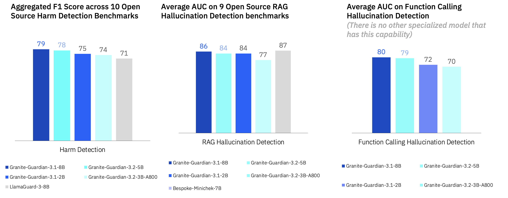

# Granite Guardian

 👉 (Feb-2025) Granite-Guardian-3.2 has landed! Two new model sizes, verbalized confidence, two new risks, updated notebooks, and results!

👉 (Dec-2024) Granite-Guardian-3.1 has landed! Updated notebooks, documentation, and results!

👉 (Dec-2024) Added :books: <a href="https://arxiv.org/abs/2412.07724">**technical report**</a> for Granite-Guardian-3.0

## Overview

The Granite Guardian models are a collection of models designed to detect risks in prompts and responses.
Trained on instruction fine-tuned Granite languages models, these models can help with risk detection along many key dimensions catalogued in the [IBM AI Risk Atlas](https://www.ibm.com/docs/en/watsonx/saas?topic=ai-risk-atlas).
These models are trained on unique data comprising human annotations from socioeconomically diverse people and synthetic data informed by internal red-teaming. 
They outperform similar models on standard benchmarks.

## Quick Links

- :books: <a href="https://arxiv.org/abs/2412.07724">**Technical Report**</a>

- **Granite Guardian Collection:**
  - 🤗 [Granite-Guardian-3.2-5B](https://huggingface.co/ibm-granite/granite-guardian-3.2-5b)
  - 🤗 [Granite-Guardian-3.2-3B-a800](https://huggingface.co/ibm-granite/granite-guardian-3.2-3b-a800m)
  - 🤗 [Granite-Guardian-3.1-8B](https://huggingface.co/ibm-granite/granite-guardian-3.1-8b)
  - 🤗 [Granite-Guardian-3.1-2B](https://huggingface.co/ibm-granite/granite-guardian-3.1-2b)
  - 🤗 [Granite-Guardian-HAP-125M](https://huggingface.co/ibm-granite/granite-guardian-hap-125m)
  - 🤗 [Granite-Guardian-HAP-38M](https://huggingface.co/ibm-granite/granite-guardian-hap-38m)
- **Granite Guardian Recipes:**
  - 📕 [Quick Start Guide](https://github.com/ibm-granite/granite-guardian/tree/main/cookbooks/granite-guardian-3.2/quick_start_vllm.ipynb) provides steps to start using Granite Guardian for detecting risks in prompts (user message), responses (assistant message), RAG use cases, or agentic workflows.
  - 📕 [Detailed Guide](https://github.com/ibm-granite/granite-guardian/tree/main/cookbooks/granite-guardian-3.2/detailed_guide_vllm.ipynb) explores different risk dimensions in depth and shows how to assess custom risk definitions with Granite Guardian. For finer-grained control over token-level risk probabilities and thresholding, please also consult this cookbook.
  - 📕 [Usage Governance Workflow](https://github.com/ibm-granite/granite-guardian/tree/main/cookbooks/granite-guardian-3.1/usage_governance_workflow_vllm.ipynb) outlines steps for users investigating AI risks within a use-case, incentivizing them to explore risks from the IBM AI Risk Atlas using Granite Guardian.
  - 📕 [Hate, Abuse, and Profanity (HAP) Detection](https://github.com/ibm-granite-community/granite-snack-cookbook/blob/main/recipes/Granite_Guardian/HAP.ipynb)
- **Demos:**
  - 🤗 [HF Spaces Demo](https://huggingface.co/spaces/ibm-granite/granite-guardian-3.1-8b)
  - ▶️ [Walkthrough with GG-3.0](https://ibm.biz/gg_demo) 
- **Additional Resources:**
  - 🤗 Datasets - [SocialStigmaQA](https://huggingface.co/datasets/ibm/SocialStigmaQA), [SocialStigmaQA-JA](https://huggingface.co/datasets/ibm/SocialStigmaQA-JA), [AttaQ](https://huggingface.co/datasets/ibm/AttaQ), [ProvoQ](https://huggingface.co/datasets/ibm/ProvoQ), [WikiContradict](https://huggingface.co/datasets/ibm/Wikipedia_contradict_benchmark)
- **Website**: [Granite Guardian Docs](https://www.ibm.com/granite/docs/models/guardian/)
- **License:** [Apache 2.0](https://www.apache.org/licenses/LICENSE-2.0)

## Risk Taxonomy

We have developed Granite Guardian using a comprehensive harm risk taxonomy and have expanded its capabilities to detect hallucinations.

| Risk | `risk_name` | Prompt | Response | Definition | version support
| :--- | :---: | :---: | :---: | :--- | :--- |
| Harm | harm | ✅ | ✅ | <details> <summary> Content considered universally harmful </summary> This is our general category, which should encompass a variety of risks including those not specifically addressed by the following categories. </details> | 3.0+ |
| Social Bias | social_bias | ✅ | ✅ | <details> <summary> Systemic prejudice against groups </summary> based on shared identity or characteristics, often stemming from stereotypes or cultural influences. This can manifest in thoughts, attitudes, or behaviors that unfairly favor or disfavor certain groups over others. </details> | 3.0+ | 
| Profanity | profanity | ✅ | ✅ | <details> <summary> Use of language considered offensive or socially unacceptable in a given context </summary> This primarily refers to curse words, swear words, and crude expressions, excluding slurs or derogatory terms targeting specific groups. </details> | 3.0+ |
| Sexual Content | sexual_content | ✅ | ✅ | <details> <summary> Material explicitly related to sexual activities, anatomy, or desires </summary> This ranges from discussions of sexual practices to graphic depictions of sexual acts, excluding content related to general relationships or non-sexual intimacy. </details> | 3.0+ |
| Unethical Behavior | unethical_behavior | ✅ | ✅ | <details> <summary> Actions that violate moral or professional standards </summary> focusing on exploitation for personal gain or disregard for others' well-being. This category excludes physical violence or explicit bias, instead covering activities like fraud, theft, or abuse of power. </details> | 3.0+ |
| Violence | violence | ✅ | ✅ | <details> <summary> Promoting or describing physical harm to individuals or groups </summary> This includes depictions of assault, self-harm, or creation of a hostile environment through threats or intimidation. </details> | 3.0+ |
| Harm Engagement | harm_engagement | ✅ | ✅ | An engagement or endorsement with any requests that are harmful or unethical | 3.2+ |
| Evasiveness | evasiveness | ✅ | ✅ | Avoiding to engage without providing sufficient reason | 3.2+ |
| Jailbreaking | jailbreak | ✅ |  | <details> <summary> Deliberate circumvention of AI systems' built-in safeguards or ethical guidelines </summary> This involves crafting specific prompts or scenarios designed to manipulate the AI into generating restricted or inappropriate content. </details> | 3.0+ |
| RAG Safety - Groundedness | groundedness |  | ✅ | <details> <summary> The LLM response includes claims, facts, or details that are not supported by or directly contradicted by the given context </summary> This risk arises in a Retrieval-Augmented Generation (RAG) system when. An ungrounded answer may involve fabricating information, misinterpreting the context, or making unsupported extrapolations beyond what the context actually states. </details> | 3.0+ |
| RAG Safety - Context Relevance | relevance | ✅ |  | <details> <summary> The retrieved or provided context fails to contain information pertinent to answering the user's question or addressing their needs </summary> Irrelevant context may be on a different topic, from an unrelated domain, or contain information that doesn't help in formulating an appropriate response to the user. </details> | 3.0+ |
| RAG Safety - Answer Relevance | answer_relevance |  | ✅ | <details> <summary> The LLM response fails to address or properly respond to the user's input </summary> This includes providing off-topic information, misinterpreting the query, or omitting crucial details requested by the User. An irrelevant answer may contain factually correct information but still fail to meet the User's specific needs or answer their intended question. </details> | 3.0+ |
| Agentic Safety - Function Calling Hallucination | function_call |  | ✅ | <details> <summary> The LLM response contains function calls that have syntax or semantic errors based on the user query and available tool definition </summary> For instance, if an AI agent purportedly queries an external information source, this capability monitors for fabricated information flows. </details> | 3.1+ |

## Usage
### Intended Use

Granite Guardian is useful for risk detection use-cases which are applicable across a wide-range of enterprise applications -  
- Detecting harm-related risks within prompt text, model responses, or conversations (as guardrails). These present fundamentally different use cases as the first assesses user supplied text, the second evaluates model generated text, and the third evaluates the last turn of a conversation.
- RAG (retrieval-augmented generation) use-case where the guardian model assesses three key issues: context relevance (whether the retrieved context is relevant to the query), groundedness (whether the response is accurate and faithful to the provided context), and answer relevance (whether the response directly addresses the user's query).
- Function calling risk detection within agentic workflows, where Granite Guardian evaluates intermediate steps for syntactic and semantic hallucinations. This includes assessing the validity of function calls and detecting fabricated information, particularly during query translation.
 
### Scope of Use

- Granite Guardian models must <ins>only</ins> be used strictly for the prescribed scoring mode, which generates yes/no outputs based on the specified template. Any deviation from this intended use may lead to unexpected, potentially unsafe, or harmful outputs. The model may also be prone to such behaviour via adversarial attacks. 
- The model is targeted for risk definitions of general harm, social bias, profanity, violence, sexual content, unethical behavior, harm engagement, evasiveness, jailbreaking, groundedness/relevance for retrieval-augmented generation, and function calling hallucinations for agentic workflows. It is also applicable for use with custom risk definitions, but these require testing.
It is also applicable for use with custom risk definitions, but these require testing.
- The model is only trained and tested on English data.
- Given their parameter size, the main Granite Guardian models are intended for use cases that require moderate cost, latency, and throughput such as model risk assessment, model observability and monitoring, and spot-checking inputs and outputs.
Smaller models, like the [Granite-Guardian-HAP-38M](https://huggingface.co/ibm-granite/granite-guardian-hap-38m) for recognizing hate, abuse and profanity can be used for guardrailing with stricter cost, latency, or throughput requirements.

## Evaluations



## Training Data
Granite Guardian 3.1 models are trained on a combination of human annotated and synthetic data. Samples from [hh-rlhf](https://huggingface.co/datasets/Anthropic/hh-rlhf) dataset were used to obtain responses from Granite and Mixtral models.
These prompt-response pairs were annotated for different risk dimensions by a group of people at DataForce.
DataForce prioritizes the well-being of its data contributors by ensuring they are paid fairly and receive livable wages for all projects.
Additional synthetic data was used to supplement the training set to improve performance for conversational, hallucination and jailbreak related risks.

### Annotator Demographics

| Year of Birth      | Age               | Gender | Education Level                                 | Ethnicity                     | Region          |
|--------------------|-------------------|--------|-------------------------------------------------|-------------------------------|-----------------|
| Prefer not to say   | Prefer not to say | Male   | Bachelor                                        | African American               | Florida         |
| 1989               | 35                | Male   | Bachelor                                        | White                         | Nevada          |
| Prefer not to say   | Prefer not to say | Female | Associate's Degree in Medical Assistant         | African American               | Pennsylvania    |
| 1992               | 32                | Male   | Bachelor                                        | African American               | Florida         |
| 1978               | 46                | Male   | Bachelor                                        | White                         | Colorado        |
| 1999               | 25                | Male   | High School Diploma                             | Latin American or Hispanic     | Florida         |
| Prefer not to say   | Prefer not to say | Male   | Bachelor                                        | White                         | Texas           |
| 1988               | 36                | Female | Bachelor                                        | White                         | Florida         |
| 1985               | 39                | Female | Bachelor                                        | Native American                | Colorado / Utah |
| Prefer not to say   | Prefer not to say | Female | Bachelor                                        | White                         | Arkansas        |
| Prefer not to say   | Prefer not to say | Female | Master of Science                               | White                         | Texas           |
| 2000               | 24                | Female | Bachelor of Business Entrepreneurship           | White                         | Florida         |
| 1987               | 37                | Male   | Associate of Arts and Sciences - AAS            | White                         | Florida         |
| 1995               | 29                | Female | Master of Epidemiology                          | African American               | Louisiana       |
| 1993               | 31                | Female | Master of Public Health                         | Latin American or Hispanic     | Texas           |
| 1969               | 55                | Female | Bachelor                                        | Latin American or Hispanic     | Florida         |
| 1993               | 31                | Female | Bachelor of Business Administration             | White                         | Florida         |
| 1985               | 39                | Female | Master of Music                                 | White                         | California      |


### Citation
```latex
@misc{padhi2024graniteguardian,
      title={Granite Guardian}, 
      author={Inkit Padhi and Manish Nagireddy and Giandomenico Cornacchia and Subhajit Chaudhury and Tejaswini Pedapati and Pierre Dognin and Keerthiram Murugesan and Erik Miehling and Martín Santillán Cooper and Kieran Fraser and Giulio Zizzo and Muhammad Zaid Hameed and Mark Purcell and Michael Desmond and Qian Pan and Zahra Ashktorab and Inge Vejsbjerg and Elizabeth M. Daly and Michael Hind and Werner Geyer and Ambrish Rawat and Kush R. Varshney and Prasanna Sattigeri},
      year={2024},
      eprint={2412.07724},
      archivePrefix={arXiv},
      primaryClass={cs.CL},
      url={https://arxiv.org/abs/2412.07724}, 
}
```
