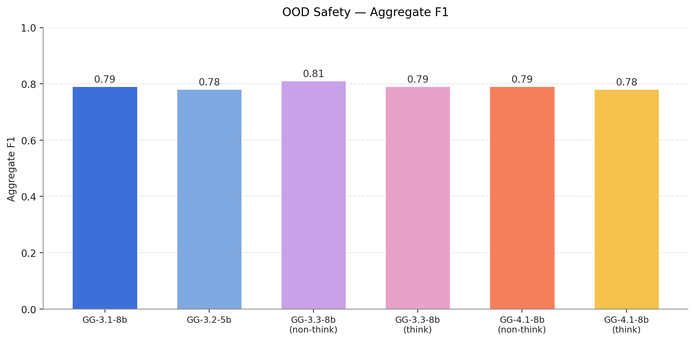
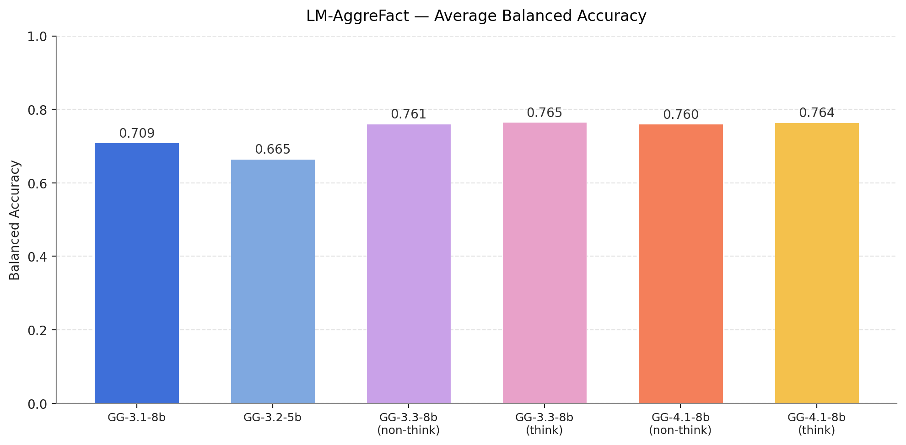
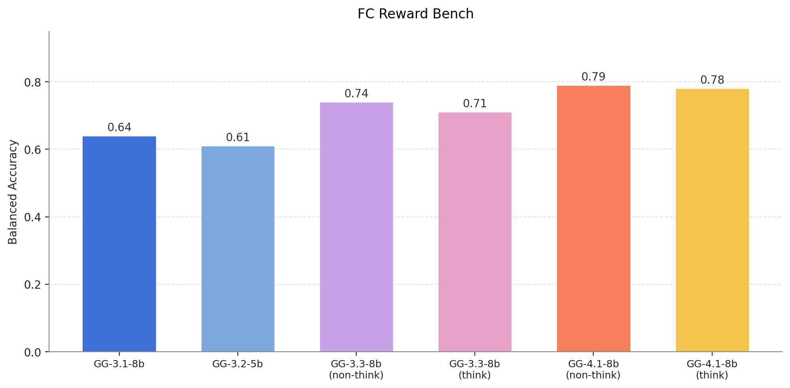
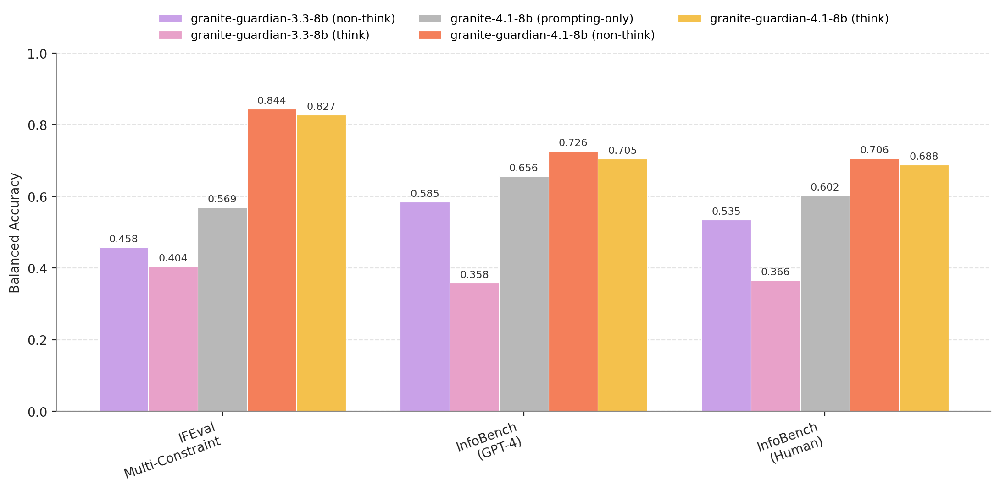
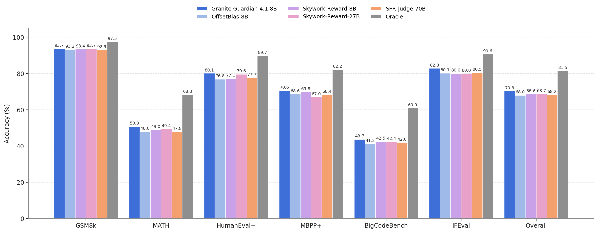

# Granite Guardian

📌  What's New?

✨ **April 2026**: [Granite-Guardian-4.1-8B](https://huggingface.co/ibm-granite/granite-guardian-4.1-8b) introduces improved Bring Your Own Criteria (BYOC) support, enabling users to define arbitrary judging criteria beyond the pre-baked safety and hallucination detectors. The model can now faithfully evaluate complex, multi-part requirements such as formatting rules, length constraints, and domain-specific instructions.

✨ **Sept 2025**: 🏆 [Granite-Guardian-3.3](https://huggingface.co/ibm-granite/granite-guardian-3.3-8b) has has secured the 3rd position on the [LLM‑AggreFact benchmark](https://llm-aggrefact.github.io/), a comprehensive fact‑checking benchmark that consolidates 11 datasets on grounded factuality. Granite Guardian 3.3 8B also holds the #1 position on the [REVEAL benchmark](https://research.google/pubs/a-chain-of-thought-is-as-strong-as-its-weakest-link-a-benchmark-for-verifiers-of-reasoning-chains/) (a dataset that evaluates the correctness of reasoning chains generated by LLMs) which is one of the 11 dimensions in LLM-AggreFact. Additionally, while our Granite Guardian model is only 8B in parameter size, it outperforms much larger models such as gpt-4o and Mistral Large 2 on this benchmark.

✨ **Sept 2025**: Two new LoRA adapters for [multi-risk detection](https://huggingface.co/ibm-granite/granite-guardian-3.2-5b-lora-harm-categories) and [harm-correction](https://huggingface.co/ibm-granite/granite-guardian-3.2-5b-lora-harm-correction) are live!

✨ **Aug 2025**: [Granite-Guardian-3.3](https://huggingface.co/ibm-granite/granite-guardian-3.3-8b) is live! 🤖 New hybrid thinking mode for better reasoning and improved bring-your-own-criteria functionality.

✨ Feb 2025: Granite-Guardian-3.2 is out! ⚙️ Adds two new model sizes, verbalized confidence, and two new risks. Updated notebooks included.

✨ Dec 2024: Granite-Guardian-3.1 has landed! 🛠️ Featuring updated notebooks, documentation, and results.

✨ Dec 2024: 📚 Check out the new technical report for Granite-Guardian-3.0.

## Overview

The Granite Guardian family is a collection of models designed to judge if the input prompts and the output responses of an LLM based system meet specified criteria. The models come pre-baked with certain criteria including but not limited to: jailbreak attempts, profanity, and hallucinations related to tool calls and retrieval augmented generation in agent-based systems. Additionally, the models also allow users to bring their own criteria and tailor the judging behavior to specific use-cases.

Trained on instruction fine-tuned Granite languages models, these models can help with detection along many key dimensions catalogued in the [IBM AI Risk Atlas](https://www.ibm.com/docs/en/watsonx/saas?topic=ai-risk-atlas).
These models are trained on unique data comprising human annotations from socioeconomically diverse people and synthetic data informed by internal red-teaming. 
They outperform similar models on standard benchmarks.

## Quick Links

- :books: <a href="https://arxiv.org/abs/2412.07724">**Technical Report**</a>

## Granite Guardian Collection

| Model Name | Model Link | Quickstart | Detailed Guide |
|---|---|---|---|
| Granite-Guardian-4.1-8B  | [🤗 Link](https://huggingface.co/ibm-granite/granite-guardian-4.1-8b)  | [📕 Link](https://github.com/ibm-granite/granite-guardian/blob/main/cookbooks/granite-guardian-4.1/quickstart.ipynb)  | [📕 Link](https://github.com/ibm-granite/granite-guardian/blob/main/cookbooks/granite-guardian-4.1/detailed_guide.ipynb)  |
| Granite-Guardian-3.3-8B  | [🤗 Link](https://huggingface.co/ibm-granite/granite-guardian-3.3-8b)  |  [📕 Link](https://github.com/ibm-granite/granite-guardian/tree/main/cookbooks/granite-guardian-3.3/quickstart.ipynb)  | [📕 Link - Think](https://github.com/ibm-granite/granite-guardian/tree/main/cookbooks/granite-guardian-3.3/detailed_guide_think.ipynb)<br>[📕 Link - No Think](https://github.com/ibm-granite/granite-guardian/tree/main/cookbooks/granite-guardian-3.3/detailed_guide_no_think.ipynb)|
| Granite-Guardian-3.2-5B-lora-harm-categories  | [🤗 Link](https://huggingface.co/ibm-granite/granite-guardian-3.2-5b-lora-harm-categories)  | [📕 Link](https://github.com/ibm-granite/granite-guardian/blob/main/cookbooks/granite-guardian-3.2-lora/harm_categories_guide_vllm.ipynb)  |  |
| Granite-Guardian-3.2-5B-lora-harm-correction  | [🤗 Link](https://huggingface.co/ibm-granite/granite-guardian-3.2-5b-lora-harm-correction)  | [📕 Link](https://github.com/ibm-granite/granite-guardian/blob/main/cookbooks/granite-guardian-3.2-lora/harm_correction_guide_vllm.ipynb)  |  |
| Granite-Guardian-3.2-5B  | [🤗 Link](https://huggingface.co/ibm-granite/granite-guardian-3.2-5b)  | [📕 Link](https://github.com/ibm-granite/granite-guardian/blob/main/cookbooks/granite-guardian-3.2/quick_start_vllm.ipynb)  | [📕 Link](https://github.com/ibm-granite/granite-guardian/blob/main/cookbooks/granite-guardian-3.2/detailed_guide_vllm.ipynb)  |
| Granite-Guardian-3.2-3B-A800M  | [🤗 Link](https://huggingface.co/ibm-granite/granite-guardian-3.2-3b-a800m)  | [📕 Link](https://github.com/ibm-granite/granite-guardian/blob/main/cookbooks/granite-guardian-3.2/quick_start_vllm.ipynb)  | [📕 Link](https://github.com/ibm-granite/granite-guardian/blob/main/cookbooks/granite-guardian-3.2/detailed_guide_vllm.ipynb)  |
| Granite-Guardian-3.1-8B  | [🤗 Link](https://huggingface.co/ibm-granite/granite-guardian-3.1-8b)  | [📕 Link](https://github.com/ibm-granite/granite-guardian/blob/main/cookbooks/granite-guardian-3.1/quick_start_vllm.ipynb)  | [📕 Link](https://github.com/ibm-granite/granite-guardian/blob/main/cookbooks/granite-guardian-3.1/detailed_guide_vllm.ipynb)  |
| Granite-Guardian-3.1-2B  | [🤗 Link](https://huggingface.co/ibm-granite/granite-guardian-3.1-2b)  | [📕 Link](https://github.com/ibm-granite/granite-guardian/blob/main/cookbooks/granite-guardian-3.1/quick_start_vllm.ipynb)  | [📕 Link](https://github.com/ibm-granite/granite-guardian/blob/main/cookbooks/granite-guardian-3.1/detailed_guide_vllm.ipynb)  |
| Granite-Guardian-HAP-125M  | [🤗 Link](https://huggingface.co/ibm-granite/granite-guardian-hap-125m)  | - | [📕 Link](https://github.com/ibm-granite-community/granite-snack-cookbook/blob/main/recipes/Granite_Guardian/HAP.ipynb)  |
| Granite-Guardian-HAP-38M  | [🤗 Link](https://huggingface.co/ibm-granite/granite-guardian-hap-38m)  | - | [📕 Link](https://github.com/ibm-granite-community/granite-snack-cookbook/blob/main/recipes/Granite_Guardian/HAP.ipynb)  |
 
- **Demos:**
  - 🤗 [HF Spaces Demo](https://huggingface.co/spaces/ibm-granite/granite-guardian)
- **Additional Resources:**
  - 🤗 Datasets - [SocialStigmaQA](https://huggingface.co/datasets/ibm/SocialStigmaQA), [SocialStigmaQA-JA](https://huggingface.co/datasets/ibm/SocialStigmaQA-JA), [AttaQ](https://huggingface.co/datasets/ibm/AttaQ), [ProvoQ](https://huggingface.co/datasets/ibm/ProvoQ), [WikiContradict](https://huggingface.co/datasets/ibm/Wikipedia_contradict_benchmark)
- **Website**: [Granite Guardian Docs](https://www.ibm.com/granite/docs/models/guardian/)
- **License:** [Apache 2.0](https://www.apache.org/licenses/LICENSE-2.0)


## Usage

**Intended Use:** The guardian model must be used strictly for the prescribed scoring mode, which generates yes/no outputs based on the specified template. Any deviation from this intended use may lead to unexpected, potentially unsafe, or harmful outputs.

### Prompt format

Granite Guardian 4.1 judges text against a criterion passed via a final user message containing a `<guardian>` block. The block has three parts:

1. **Mode selector** — `<think>` (reasoning trace before the score) or `<no-think>` (score only, lowest latency).
2. **`### Criteria:`** — a pre-baked definition (e.g. groundedness, function-call hallucination, harm) or any custom BYOC rule.
3. **`### Scoring Schema:`** — a fixed line that forces a binary `yes` / `no` inside `<score>...</score>` tags.

The helper below assembles the block and parses the output; both examples reuse it.

```python
import re
import json
from vllm import LLM, SamplingParams
from transformers import AutoTokenizer

model_path = "ibm-granite/granite-guardian-4.1-8b"
tokenizer = AutoTokenizer.from_pretrained(model_path)
llm = LLM(model=model_path, max_model_len=8192)
sampling_params = SamplingParams(temperature=0.0, max_tokens=2048)

GUARDIAN_JUDGE_THINK = (
    "<think>As a judge agent, carefully analyze whether the provided text meets the "
    "given judging criteria. Use all available information, including conversations, "
    "documents, and tools. Reason through the evidence step by step before providing "
    "your score. Wrap your reasoning in <think></think> tags, then provide your "
    "score in <score></score> tags."
)
GUARDIAN_JUDGE_NOTHINK = (
    "<no-think>As a judge agent, assess whether the provided text meets the given "
    "judging criteria using all available information, including conversations, "
    "documents, and tools. Provide your score immediately without explanation. "
    "Output empty <think>\\n</think> tags followed by your score in <score></score> tags."
)

def build_guardian_block(criteria, think=False):
    judge_instruction = GUARDIAN_JUDGE_THINK if think else GUARDIAN_JUDGE_NOTHINK
    return (
        f"<guardian>{judge_instruction}\n\n"
        f"### Criteria: {criteria}\n\n"
        f"### Scoring Schema: If the last assistant's text meets the criteria, "
        f"return 'yes'; otherwise, return 'no'."
    )

def parse_response(response):
    trace_match = re.findall(r"<think>(.*?)</think>", response, re.DOTALL)
    score_match = re.findall(r"<score>\s*(.*?)\s*</score>", response, re.DOTALL)
    trace = trace_match[-1].strip() if trace_match else None
    score = score_match[-1].strip().lower() if score_match else None
    return score, trace
```

### Example 1: Detect groundedness in RAG settings (think mode)

Pass retrieved documents via `documents=` in `apply_chat_template`. With `think=True` the model emits a reasoning trace before the score.

```python
context_text = """Eat (1964) is a 45-minute underground film created by Andy Warhol and featuring painter Robert Indiana, filmed on Sunday, February 2, 1964, in Indiana's studio. The film was first shown by Jonas Mekas on July 16, 1964, at the Washington Square Gallery at 530 West Broadway.
Jonas Mekas (December 24, 1922 – January 23, 2019) was a Lithuanian-American filmmaker, poet, and artist who has been called "the godfather of American avant-garde cinema"."""
documents = [{"doc_id": "0", "text": context_text}]
response_text = "The film Eat was first shown by Jonas Mekas on December 24, 1922 at the Washington Square Gallery at 530 West Broadway."

criteria = (
    "A text is considered ungrounded or unfaithful if it includes information "
    "lacking support from, or directly contradicting, the provided document(s). "
    "This risk arises when the text fabricates details, misinterprets the content, "
    "or makes unsupported extrapolations beyond what is explicitly stated in the "
    "document(s)."
)

messages = [
    {"role": "assistant", "content": response_text},
    {"role": "user", "content": build_guardian_block(criteria, think=True)},
]

prompt = tokenizer.apply_chat_template(
    messages, tokenize=False, add_generation_prompt=True, documents=documents
)
output = llm.generate([prompt], sampling_params)
response = output[0].outputs[0].text.strip()

score, trace = parse_response(response)
print(f"# score: {score}")  # yes
print(f"# trace: {trace}")
```

### Example 2: Detect function-calling hallucination (no-think mode)

For agentic workflows, pass the tool schemas via `available_tools=` in `apply_chat_template`. No-think mode is preferred on the hot path for low-latency yes/no gating.

```python
tools = [{
    "name": "comment_list",
    "description": "Fetches a list of comments for a specified video using the given API.",
    "parameters": {
        "aweme_id": {"description": "The ID of the video.", "type": "int", "default": "7178094165614464282"},
        "cursor":   {"description": "The cursor for pagination. Defaults to 0.", "type": "int, optional", "default": "0"},
        "count":    {"description": "The number of comments to fetch. Maximum is 30. Defaults to 20.", "type": "int, optional", "default": "20"},
    },
}]

user_text = "Fetch the first 15 comments for the video with ID 456789123."
response_text = json.dumps([{
    "name": "comment_list",
    "arguments": {
        "video_id": 456789123,  # Wrong argument name: should be "aweme_id"
        "count": 15,
    },
}])

criteria = (
    "Function call hallucination occurs when a text includes function calls that "
    "either don't adhere to the correct format defined by the available tools or "
    "are inconsistent with the query's requirements. This risk arises from function "
    "calls containing incorrect argument names, values, or types that clash with "
    "the tool definitions or the query itself."
)

messages = [
    {"role": "user", "content": user_text},
    {"role": "assistant", "content": response_text},
    {"role": "user", "content": build_guardian_block(criteria, think=False)},
]

prompt = tokenizer.apply_chat_template(
    messages, tokenize=False, add_generation_prompt=True, available_tools=tools
)
output = llm.generate([prompt], sampling_params)
response = output[0].outputs[0].text.strip()

score, _ = parse_response(response)
print(f"# score: {score}")  # yes
```

For a detailed walkthrough with think/no-think comparisons across harm, groundedness, function-calling, and BYOC examples, see the [4.1 detailed guide](https://github.com/ibm-granite/granite-guardian/blob/main/cookbooks/granite-guardian-4.1/detailed_guide.ipynb).

## Evaluations

### OOD Safety Benchmarks

F1 scores on out-of-distribution safety benchmarks. Granite Guardian 4.1 stays competitive with prior releases on OOD safety, leading on OAI-hf, Toxic Chat, and Simple Safety.



### RAG Hallucination Benchmarks

Balanced accuracy on [LM-AggreFact](https://llm-aggrefact.github.io/) benchmarks. Granite Guardian 4.1 think matches 3.3 think on the aggregate average (0.76) and improves on RAGTruth, ClaimVerify, and Wice.



### Function Calling Hallucination Benchmarks

Balanced accuracy on the [FC Reward Bench](https://huggingface.co/datasets/ibm-research/fc-reward-bench) evaluation dataset. Non-think mode improves from 0.74 (3.3) to 0.79 (4.1).



### Bring Your Own Criteria (BYOC) Evals

The following benchmarks evaluate BYOC capability by testing the model's ability to judge whether LLM outputs satisfy diverse user-specified requirements:

- **IFEval Multi-Constraint**: Instruction-following evaluation where each prompt has multiple verifiable constraints (e.g., *"Wrap your entire response with double quotation marks"*, *"The last word of your response should be the word complaint"*).
- **InfoBench**: Instructions are decomposed into fine-grained yes/no requirement questions (e.g., for *"Make a list of top U.S. places to visit"*: *"Is the generated text a list of places?"*, *"Are the places located in the U.S.?"*). Evaluated with both GPT-4 and human annotations.



Guardian training provides large gains over prompting-only, particularly on IFEval multi-constraint (BAcc 0.569 → 0.844), demonstrating that the model learns to apply arbitrary user-specified criteria rather than just the pre-baked ones.

### Best-of-N Selection with Guardian as a Reward Model (JETTS)

Granite Guardian 4.1 can also serve as a reward model for best-of-N selection, where multiple candidate responses are generated and the guardian scores each one, selecting the best. We evaluate this on the verifiable tasks in the [JETTS benchmark](https://openreview.net/pdf?id=CgJEHynkJt) (no-think mode). Baseline results are from Table 4.



Granite Guardian 4.1 8B achieves the highest overall score (70.29) among all tested reward models, outperforming models up to 70B parameters and demonstrating strong generalization across math, code, and instruction-following tasks.

## Scope of Use

- Granite Guardian models must <ins>only</ins> be used strictly for the prescribed scoring mode, which generates yes/no outputs based on the specified template. Any deviation from this intended use may lead to unexpected, potentially unsafe, or harmful outputs. The model may also be prone to such behaviour via adversarial attacks.
- The reasoning traces or chain of thoughts may contain unsafe content and may not be faithful.
- The model is trained to assess general harm, social bias, profanity, violence, sexual content, unethical behavior, jailbreaking, or groundedness/relevance for retrieval-augmented generation, and function calling hallucinations for agentic workflows.
It is also applicable for use with custom criteria, but these require testing.
- The model is only trained and tested on English data.
- Given their parameter size, the main Granite Guardian models are intended for use cases that require moderate cost, latency, and throughput such as model assessment, model observability and monitoring, and spot-checking inputs and outputs.
Smaller models, like the [Granite-Guardian-HAP-38M](https://huggingface.co/ibm-granite/granite-guardian-hap-38m) for recognizing hate, abuse and profanity can be used for guardrailing with stricter cost, latency, or throughput requirements.


## Citation
```latex
@misc{padhi2024graniteguardian,
      title={Granite Guardian}, 
      author={Inkit Padhi and Manish Nagireddy and Giandomenico Cornacchia and Subhajit Chaudhury and Tejaswini Pedapati and Pierre Dognin and Keerthiram Murugesan and Erik Miehling and Martín Santillán Cooper and Kieran Fraser and Giulio Zizzo and Muhammad Zaid Hameed and Mark Purcell and Michael Desmond and Qian Pan and Zahra Ashktorab and Inge Vejsbjerg and Elizabeth M. Daly and Michael Hind and Werner Geyer and Ambrish Rawat and Kush R. Varshney and Prasanna Sattigeri},
      year={2024},
      eprint={2412.07724},
      archivePrefix={arXiv},
      primaryClass={cs.CL},
      url={https://arxiv.org/abs/2412.07724}, 
}
```

## Resources
- ⭐️ Learn about the latest updates with Granite: https://www.ibm.com/granite
- 📄 Get started with tutorials, best practices, and prompt engineering advice: https://www.ibm.com/granite/docs/
- 💡 Learn about the latest Granite learning resources: https://ibm.biz/granite-learning-resources
